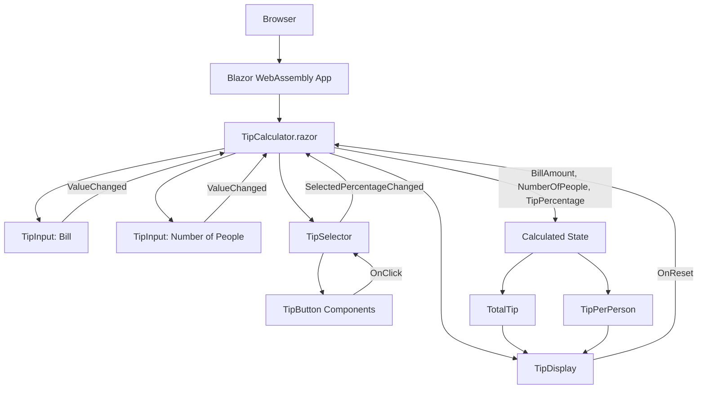

# Tip Calculator App

A responsive tip calculator built with Blazor WebAssembly as part of a Frontend Mentor challenge. This project demonstrates component-based UI development, parent-child state management, and CSS isolation in Blazor.

## Overview

### The Challenge

Users should be able to:

- Enter a bill amount
- Select a preset tip percentage
- Enter the number of people sharing the bill
- View the tip amount per person
- View the total tip amount
- Reset the calculator
- Use the app on mobile and desktop screen sizes

## Built With

- Blazor WebAssembly
- .NET 10
- Razor components
- CSS
- Frontend Mentor starter assets

## Project Structure

```text
BlazorTipCalculator/
├── BlazorTipCalculator.slnx
└── BlazorTipCalculator/
    ├── Components/
    │   ├── TipButton.razor
    │   ├── TipDisplay.razor
    │   ├── TipInput.razor
    │   └── TipSelector.razor
    ├── Pages/
    │   └── TipCalculator.razor
    └── wwwroot/
        ├── css/app.css
        └── img/
```

### Each component has a single responsibility:

- TipInput – Reusable numeric input component.
- TipSelector – Manages tip percentage selection.
- TipButton – Reusable selectable percentage button.
- TipDisplay – Displays calculated tip values.

## Software Architecture



The main page owns the calculator state and passes data down to child components through parameters. Child components communicate user actions back to the page with event callbacks, which keeps the calculation logic centralized while the UI stays split into reusable pieces.

## Getting Started

### Prerequisites

Install the .NET SDK that supports the target framework used by this project.

### Run Locally

From the project root:

```bash
dotnet run --project BlazorTipCalculator/BlazorTipCalculator.csproj
```

Then open:

```text
http://localhost:5181
```

## What I Learned

This project was a good opportunity to rebuild a Frontend Mentor JavaScript challenge in Blazor. The calculator logic is handled through component parameters and event callbacks, keeping the form inputs, percentage selector, and result display split into focused Razor components.


## Future Improvements

Potential enhancements include:

- Custom tip percentage input
- Input validation and error messages
- Keyboard accessibility improvements
- Dark mode support
- Unit testing with bUnit


## Design Credit
The UI design was provided by Frontend Mentor as part of one of their frontend development challenges.

- Frontend Mentor challenge: [Tip calculator app](https://www.frontendmentor.io/challenges/tip-calculator-app-ugJNGbJUX)
